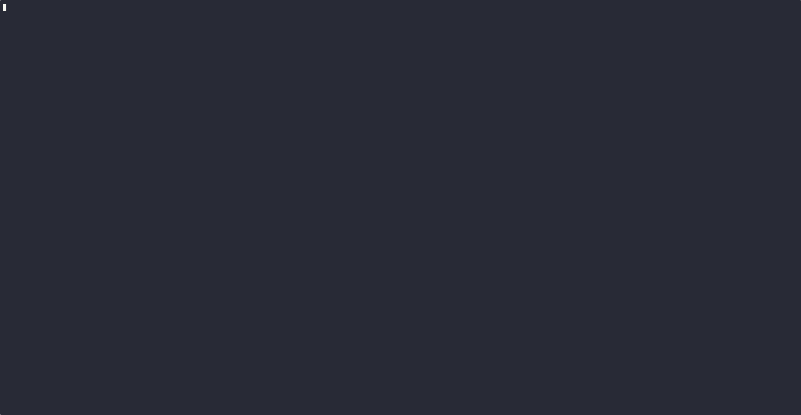

# pwcli - Highly Secure CLI Password Manager

A simple, but highly secure CLI password manager with an interactive TUI, fully encrypted vault storage, and AES-256-GCM encryption.

## Demo



## Features

- **Secure Encryption**: AES-256-GCM with scrypt key derivation
- **Fancy Interactive TUI**: Beautiful terminal interface with fuzzy search
- **Live Fuzzy Search**: Quickly find entries as you type
- **Clipboard Integration**: Auto-copy passwords with automatic clearing after 20s
- **File Locking**: Prevents concurrent vault corruption
- **Secure Deletion**: Best-effort secure wipe when nuking vault
- **Import/Export**: Backup and migration capabilities
- **Audit Logging**: Track all vault operations
- **Zero Config**: Works out of the box with sensible defaults

## Security

### Encryption Details

- **Algorithm**: AES-256-GCM (Galois/Counter Mode)
- **Key Derivation**: scrypt with N=32768, r=8, p=1
- **Salt**: 16 random bytes per vault
- **IV**: 12 random bytes per encryption operation
- **Authentication**: GCM authentication tag ensures integrity

### Security Features

- Master password never stored on disk
- All vault data encrypted at rest
- No plaintext secrets ever written to disk
- Fail-closed: operations fail without correct master password
- Clipboard auto-clears after 20 seconds
- Concurrent write corruption prevention using file locking
- Persistent rate limiting on password attempts (1 per second, 10 attempts = 5min lockout)
- Password strength validation during setup
- Memory wiping of sensitive data after use
- Restricted file permissions (0o600) for all sensitive files
- Comprehensive audit logging of all vault operations
- Secure wipe on vault deletion (best-effort)

### Vault File Structure

The vault file (`~/.pw-vault.json` by default) contains:

```json
{
  "kdf": "scrypt",
  "salt": "<base64>",
  "iv": "<base64>",
  "authTag": "<base64>",
  "data": "<base64 encrypted payload>"
}
```

The encrypted payload contains:

```json
{
  "entries": {
    "entry-key": {
      "username": "optional-username",
      "password": "the-password"
    }
  },
  "createdAt": "ISO-8601 timestamp",
  "updatedAt": "ISO-8601 timestamp"
}
```

## Important Note
Your master password is the only key to your vault. If you lose it, your data cannot be recovered. Choose wisely and store it securely!

## Installation

### Prerequisites

- Node.js 18 or higher

### Install from npm

```bash
npm install -g @freakynit/pwcli
```

### Install from GitHub

```bash
npm install -g freakynit/pwcli
```

### Install from Source

Clone and install:

```bash
git clone https://github.com/freakynit/pwcli.git
cd pwcli
npm install
npm link
```

Or install directly from the project directory:

```bash
npm install -g .
```

## Usage

### First Run

On first run, pwcli will guide you through setup:

```bash
pwcli
```

You'll be asked to:

1. Choose vault file location (default: `~/.pw-vault.json`)
2. Create a master password
3. Confirm the master password

### Interactive Mode (Default)

Simply run `pwcli` to enter interactive menu mode:

```bash
pwcli
```

#### Menu Options

- **Search / Get password**: Fuzzy search for an entry and copy password to clipboard
- **Add entry**: Create a new password entry
- **Update entry**: Modify an existing entry
- **Delete entry**: Remove an entry from vault
- **List all keys**: Display all entry names (no passwords)
- **Change master password**: Update your master password
- **Change vault location**: Move vault to a new location
- **Export vault**: Export encrypted vault to unencrypted JSON (use with caution!)
- **Import vault**: Import entries from exported JSON file
- **Nuke all (DANGER)**: Securely delete entire vault
- **Quit**: Exit pwcli

### Direct Commands

You can also run commands directly:

```bash
# Search/get password
pwcli search

# Add new entry
pwcli add

# Update entry
pwcli update

# Delete entry
pwcli delete

# List all keys
pwcli list

# Change master password
pwcli change-master

# Change vault location
pwcli change-file

# Export vault (unencrypted export!)
pwcli export

# Import vault
pwcli import

# Nuke vault (dangerous!)
pwcli nuke
```

### Typical Workflow

#### Adding a Password

1. Run `pwcli` or `pwcli add`
2. Enter master password
3. Enter entry name (e.g., "github", "email", "work-vpn")
4. Enter username (optional)
5. Enter password

#### Getting a Password

1. Run `pwcli` or `pwcli search`
2. Enter master password (rate limited)
3. Start typing to fuzzy search
4. Press Enter on the desired entry
5. Password is copied to clipboard
6. Clipboard auto-clears after 20 seconds

#### Updating a Password

1. Run `pwcli` or `pwcli update`
2. Enter master password
3. Search for entry to update
4. Enter new username/password
5. Changes saved and re-encrypted

#### Exporting Vault

1. Run `pwcli` and select "Export vault"
2. Enter master password for verification
3. Choose export location (default: vault-name-export.json)
4. **⚠️ WARNING**: Export file is unencrypted - keep secure and delete when done

#### Importing Vault

1. Run `pwcli` and select "Import vault"
2. Enter path to export file
3. Choose new vault location
4. Set master password for new vault
5. Entries are imported and encrypted

## Configuration

pwcli stores minimal configuration in `~/.pwcli.json`:

```json
{
  "vaultPath": "/absolute/path/to/vault.json"
}
```

**No secrets are stored in this file.** Only the path to your encrypted vault.

## Audit Logging

All vault operations are logged for security auditing in `~/.pwcli-audit.json`:

- **vault_access**: Successful/failed vault unlock attempts
- **vault_create**: New vault creation
- **vault_export**: Export operations
- **vault_import**: Import operations

Each log entry includes:
- Timestamp (ISO-8601)
- Action performed
- Additional details
- Success/failure status
- Process ID

Logs are automatically rotated to keep only the last 1000 entries and use secure permissions (0o600).

## Releavnt Files That Are Created on Your System

pwcli creates these files in your home directory:

- `~/.pw-vault.json` - Your encrypted password vault
- `~/.pwcli.json` - Configuration (vault path only)
- `~/.pwcli-attempts.json` - Rate limiting attempts (auto-created)
- `~/.pwcli-audit.json` - Audit log of all operations (auto-created)
- Export files you create (unencrypted - use with caution!)

## Troubleshooting

### Invalid Password Error

If you see "Decryption failed - invalid password or corrupted vault":

- Double-check you're entering the correct master password
- Ensure vault file hasn't been corrupted
- If you've forgotten your password, there's no recovery (encryption is secure!)

### Lock Errors

If you get lock-related errors:

- Another pwcli process may be writing to the vault
- Wait a moment and retry
- If persistent, check for stale `.lock` files next to your vault

### Corrupted Vault

If your vault file is corrupted:

- Restore from backup if available
- No way to recover without valid encrypted data
- This is why secure backups are important!

### Permission Errors

If you can't read/write vault:

- Check file permissions: `ls -la ~/.pw-vault.json`
- Ensure you own the file: `chown $USER ~/.pw-vault.json`

### Clipboard Not Working

- Ensure your system supports clipboard operations
- On Linux, you may need `xclip` or `xsel` installed
- On WSL, clipboard support may be limited

## Nuke (Secure Deletion)

The "Nuke" operation permanently destroys your vault:

1. Requires master password verification
2. Must type "NUKE" to confirm
3. Requires additional confirmation prompt
4. Overwrites vault file with random data
5. Overwrites with zeros
6. Deletes vault file and configuration

**This is irreversible!** All passwords will be permanently lost. After nuking, you can run `pwcli` again to set up a fresh vault.

### Secure Deletion Limitations

⚠️ **Important**: The secure deletion feature has inherent limitations:

- **SSDs with Wear Leveling**: Solid-state drives with wear leveling algorithms may not overwrite data in the same physical location, potentially leaving copies in hidden sectors
- **Copy-on-Write Filesystems**: Filesystems like ZFS, Btrfs, or modern Linux filesystems may keep copies in snapshots or other locations
- **Filesystem Journaling**: Some filesystems maintain journals that may temporarily store file copies
- **Operating System Caching**: The OS may maintain cached copies in memory or swap files

**Recommendation**: For truly secure deletion, consider:
- Using full-disk encryption at the OS level
- Physically destroying storage media for maximum security
- Using secure deletion tools like `shred` (Linux) or secure wipe utilities (macOS/Windows)
- Storing the vault on encrypted filesystems (LUKS, FileVault, BitLocker)

## Best Practices

### Password Security

- Use a strong, unique master password
- Never share your master password
- Store master password in a secure location (not in the vault!)
- Consider using a passphrase (e.g., "correct-horse-battery-staple")

### Vault Backup

- Regularly backup your vault file
- Store backups securely (they're encrypted!)
- Test backup restoration periodically

### General Usage

- Don't leave terminal open with vault decrypted
- Clear terminal scrollback after viewing sensitive data
- Be aware of screen sharing when using pwcli
- Use list/search instead of displaying all passwords

## License

MIT

## Contributing

Contributions welcome! Please ensure:

- Code follows existing style
- Security considerations are maintained
- No plaintext secrets in logs or errors

## Disclaimer

- This is a personal password manager tool. While it uses industry-standard encryption, use at your own risk. Always maintain backups of your vault file. The authors are not responsible for lost passwords or data.
- Also, this is 100% vibe-coded. But, reviewed multiple times thereafter.

## Support

For issues, questions, or contributions, please open an issue on the [GitHub repository](https://github.com/freakynit/pwcli).

## Author

Created by [@freakynit](https://github.com/freakynit)

---

**Remember**: Your master password is the only key to your vault. If you lose it, your data cannot be recovered. Choose wisely and store it securely!
